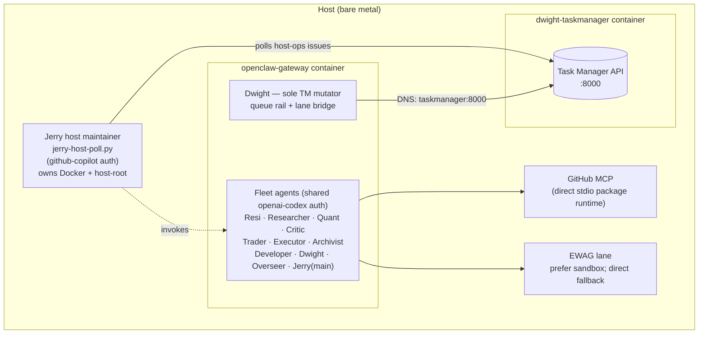

# OpenClaw Architecture Spec (Canonical)

> ⚠️ **SUPERSEDED (2026-06-06).** The authoritative system description is now
> [`SYSTEM_ARCHITECTURE.md`](SYSTEM_ARCHITECTURE.md) (topology v4 + Risk gate +
> World-Model layer). Retained for history only; where it disagrees with the
> canonical doc, the latter wins. Known-stale sections: §9b (retired
> pq-rail/lane-bridge), §9c (systemd claims — now host cron), fleet list (missing Risk).

Date: 2026-05-25
Last reconciled: 2026-06-06 (see §9c — containerized gateway + host-Jerry topology)
Status: superseded by SYSTEM_ARCHITECTURE.md
Scope: control plane, coding lane routing, execution contract, operator safety.

## 1) Core model (literal)

- Runtime layering is hybrid and intentional:
  - OpenClaw agent runtime host executes turns.
  - Codex SDK is the model loop for openai/gpt-* turns.
  - ACP is disabled by policy (no fallback).
- Telegram is control/status UX, not the coding execution loop.
- Coding execution is detached task style, not a chat-only turn.
- Repo isolation target is git worktree per task.

## 2) Current hard facts from live config/scripts

- `models.providers.openai.agentRuntime.id = "codex"` is configured.
- ACP backend is disabled through config policy:
  - `acp.enabled = false`
  - `plugins.entries.acpx.enabled = false`
- Dwight execution trigger is defined in prompt policy:
  - `run issue <id> --repo <abs-path> ...` maps to
  - `/home/aaron/.openclaw/scripts/dwight-launch-from-issue.py ... --execute`
- Dwight workspace policy also requires immediate launch for ready coding issues:
  - actionable coding story
  - assigned to `Jerry|Resi|Druck|Dwight`
  - repo path known
  - do not wait for Aaron to repeat the request

## 3) Canonical coding lanes

- `inline`: owner agent executes directly in its Codex-backed turn.
- `codex-subagent`: owner/coder agent executes via native Codex subagent (`spawn_agent`) contract.

ACP external lane is retired and must not be used.

Lane meanings are strict. Do not use `codex` as a lane label.

## 4) Deterministic routing policy (implemented)

Inputs:
- `scope`: `low|medium|high`
- `risk`: `low|medium|high`
- `expected-files`: integer
- `tag-heavy`: `true|false`

Decision rules in order:
1. If `scope=medium|high` OR `risk=high` OR `expected-files>=2` -> `codex-subagent`
2. Else if `tag-heavy=true` -> `codex-subagent`
3. Else -> `inline`

Fallback chain:
- `codex-subagent -> inline`
- `inline -> inline`

## 5) ACP policy (retired)

ACP preflight and ACP runtime fallback are retired.
Any legacy ACP inputs are coerced to `codex-subagent` and annotated in routing metadata.

## 7) Metadata contract (implemented)

Each run writes JSON to:
- `~/.openclaw/tmp/coding-lane-runs/<task-id>.<timestamp>.json`

Routing payload fields:

```json
{
  "requestedLane": "codex-subagent|inline",
  "lane": "codex-subagent|inline",
  "reason": "...",
  "fallbackLane": "codex-subagent|inline",
  "fallbackApplied": true,
  "fallbackReason": "...",
  "scope": "low|medium|high",
  "expectedFiles": 8,
  "risk": "low|medium|high",
  "heavyTag": true,
  "acpAvailable": false,
  "acpAgent": "disabled",
  "acpPreflight": { "status": "not-run", "detail": "acp-disabled-by-policy" }
}
```

## 8) Execution entrypoints (canonical)

- Telegram to Dwight (preferred control plane):
  - `run issue <id> --repo <abs-path> [--scope ... --expected-files ... --risk ... --agent-timeout ...]`
- Deterministic server CLI path:
  - `/home/aaron/.openclaw/scripts/dwight-launch-from-issue.py --issue-id <id> --repo <abs-path> ... --execute`
- Direct lane launcher path:
  - `/home/aaron/.openclaw/scripts/launch-coding-task.sh --task-id <id> --repo <abs-path> --goal <text> ... [--execute]`

## 9) Task Manager execution state

Current implemented behavior:
- Dwight can launch repo-backed coding work from a Task Manager issue.
- Owner agent is inferred from `assigned_to`.
- Repo can be inferred from `repo_path`, `repository_path`, `repo`, `repository`, `workspace`, or `repo_slug`.
- Goal is inferred from title/summary/description.
- Acceptance criteria is passed through when present.

> Status note (2026-06-05): The `auto_launch_enabled`/`launch_state`/`launch_claim`
> model described later in this section was specified but never implemented in the
> Task Manager backend, and the legacy `tm-ready-watcher.sh` is permanently
> disabled. The actually-implemented event surface for Trading Intel is now the
> **Dwight Lane Bridge** (see §9b). The launch-claim/result endpoints described
> below are tolerated as optional by `dwight-launch-from-issue.py` (it falls back
> to a regular `[LANE-EXEC]` Dwight comment when the endpoints are missing).
- Task Manager now owns the auto-launch readiness queue through `auto_launch_enabled`, `launch_state`, `launch_error`, `last_launch_at`, and the internal `launch_signature`.
- Task Manager now performs the first deterministic queue step itself when a code-backed issue becomes ready.
- The canonical launch path is:
  - Task Manager issue update
  - detached spawn of `/home/aaron/.openclaw/scripts/dwight-launch-from-issue.py --issue-id <id> --execute`
  - lane routing through `/home/aaron/.openclaw/scripts/launch-coding-task.sh`
  - launcher result postback to Task Manager via `POST /api/issues/{id}/launch-result`
- Polling watcher execution path is retired. Launch orchestration is event-driven only:
  - Task Manager issue readiness transition
  - detached canonical Dwight launcher
  - launcher result postback to Task Manager
  - GitHub webhook PR events for review/completion contract updates

Readiness contract for automatic launch:
- `auto_launch_enabled = true`
- `launch_state = ready` for Task Manager queueing
- `launch_state = queued` once Task Manager has detached the canonical launcher
- `launch_state = launched|failed` after launcher postback records the real execution outcome
- `assigned_to` present and maps to `Jerry|Resi|Druck|Dwight`
- repo path resolvable to an absolute local checkout
- branch present for code-bearing stories
- goal/title concrete enough to execute
- acceptance criteria present
- story is code-backed, not admin-only
- no approval-gated language such as "awaiting approval" or "requires sign-off"

Automation boundary:
- Auto-start is appropriate once readiness contract is satisfied.
- Auto-PR creation is appropriate after code/tests/evidence exist.
- Auto-merge, deploy, external sends, account changes, and destructive operations remain approval-gated.

Current operator visibility:
- Task Manager Search now exposes preset operator views for:
  - ready but not queued
  - queued/launched without recent evidence
  - in progress without PR-open evidence
- this is now the primary operator surface for backlog/launch hygiene before adding more automation

Event re-entry rule:
- one Task Manager launch signature launches once
- `launch_state=queued` is treated as already queued/launched by Task Manager and is never re-launched by polling
- comment-only progress does not requeue work
- a real issue edit in Task Manager can create a new ready signature and permit a new launch
- queue discipline default is one active `queued|launched` code task per executing agent at a time
- structured completion evidence now requires explicit branch and PR status, even when no PR is opened

## 9b) Trading Intel control plane (Dwight queue rail + lane bridge) — 2026-06-05

The Trading Intel pipeline uses a deterministic two-stage control plane. Dwight
is the only lane that mutates Task Manager state. All other lanes contribute by
appending to the priority queue or by replying when invoked.

Stage 1: priority queue → Task Manager issue (Dwight queue rail)
- Any lane (Researcher, Quant, Critic, Trader, Executor, Archivist, Developer,
  Overseer) that notices a needed improvement appends a row to
  `~/.openclaw/state/priority-queue.jsonl` with `{id, submitted_by,
  submitted_at, category, title, details, priority(1-5), status, claimed_by,
  task_id}`.
- `~/.openclaw/scripts/dwight-pq-rail.sh` → `workspaces/dwight/scripts/poll_priority_queue.py`
  reads open/claimed rows with empty `task_id`, resolves the canonical lane via
  explicit `assigned_to` → keyword rules → category fallback, deduplicates
  against existing TM issues by `pq:<id>` marker, creates/patches the TM issue,
  posts a Dwight `Queue handoff` comment, and appends a reconciliation row
  backfilling `claimed_by=dwight` and `task_id`.
- HTTP I/O: every TM client script honors `TASK_MANAGER_URL`. Inside the
  gateway container this is `http://taskmanager:8000` (shared docker-network DNS
  alias); on the host (Jerry) it is `http://127.0.0.1:8000` (TM publishes
  `0.0.0.0:8000`). The legacy `docker exec -i dwight-taskmanager python -`
  fallback only functions where a docker socket is present (the host); it is
  **not** available inside the gateway container since `docker.sock` was removed
  (§9c), so in-container scripts must resolve the DNS alias directly. Scripts
  that still hardcoded `127.0.0.1:8000` (e.g. `dwight-launch-from-issue.py`,
  `reconcile-task-manager-with-git.py`) were fixed 2026-06-06 to read
  `TASK_MANAGER_URL`.
- Cron: `dwight-pq-poll-6h` (every 6h, enabled).

Stage 2: Task Manager issue → lane execution (Dwight lane bridge)
- `~/.openclaw/scripts/dwight-lane-bridge.sh` → `dwight-lane-bridge.py`.
- Scans TM for issues with `created_by=Dwight` and a `pq:` marker. Idempotency
  is marker-based (no separate state file) and **retry-aware**: a `[LANE-BRIDGE]`
  marker with `rc=0` (or a plain `[LANE-EXEC] state=…`) is terminal and the issue
  is skipped (`already_bridged`); a marker recording a failed attempt
  (`rc!=0` / `status=timeout`) is retryable up to `DWIGHT_LANE_MAX_ATTEMPTS`
  (default 3), after which the issue is parked (`retry_exhausted_N`) for human
  review instead of being silently stranded.
- Dispatch by `assigned_to`:
  - `Developer` → spawns `dwight-launch-from-issue.py --execute --repo
    ${TM_DEFAULT_REPO:-/home/aaron/.openclaw}` which routes through
    `launch-coding-task.sh` and the codex subagent contract. The shell launcher
    is invoked via `bash <script>` (not by executing the file path) so a missing
    exec bit — common after git checkouts or container volume mounts — cannot
    break the launch. Result posted as a `[LANE-BRIDGE]` comment with
    stdout/stderr tails.
  - `Researcher | Quant | Critic | Trader | Executor | Archivist` → invokes
    `openclaw agent --agent <id> --message "<issue brief>" --json --timeout
    600`. The agent's textual reply is posted as a `[LANE-RESPONSE]` comment
    by Dwight, followed by a `[LANE-BRIDGE]` marker.
  - `Overseer | Dwight | Aaron | Jerry` → skipped (control-plane lanes self-
    drive; the bridge does not push their work for them).
- HTTP I/O honors `TASK_MANAGER_URL` (in-container `http://taskmanager:8000`).
  The docker-exec fallback only works on the host; see Stage 1 note.
- The run summary reports `skipped_count` = the number of *issues* skipped this
  pass (every non-eligible issue: `not_dwight_created`, `status_done`,
  `control_lane_*`, `already_bridged`, `retry_exhausted_N`, `no_pq_marker`).
  It is a count, **not** a Task Manager issue id (e.g. "Skipped: 152" means 152
  issues were skipped, not issue #152).
- Cron: `dwight-lane-bridge-3h` (every 3h, enabled, `--max-launches 3`).

Architectural invariants:
- Dwight is the only lane that mutates TM. Other lanes only think and reply.
- Cross-lane delegation (overseer → researcher/quant/critic/trader/executor/
  archivist via the subagent `spawn_agent` contract) is governed by
  `agents.defaults.subagents.maxConcurrent` (8) and `agents.defaults.maxConcurrent`
  (4). These were unset before 2026-06-06, so the pipeline exhausted the low
  default cap and surfaced as recurring "agent thread limit reached" /
  "spawn_agent unavailable" tickets. `subagents.archiveAfterMinutes` (60) reaps
  stale child sessions, but completed children should still be explicitly
  closed immediately after `wait` / `wait_agent` results are consumed rather
  than left for later reap. Hot-applied — no gateway restart required.
- Script execution runs on the **gateway runtime** (`tools.exec.host=gateway`,
  `agents.defaults.sandbox.mode=off`), which is itself the `openclaw-gateway`
  container (see §9c). Because `~/.openclaw` is bind-mounted into that container
  at the same absolute path, `~/.openclaw/scripts/*` permissions/paths resolve
  identically to the host. The gateway reaches Task Manager over a shared docker
  network (DNS alias `taskmanager`, `TASK_MANAGER_URL=http://taskmanager:8000`),
  with the legacy `docker exec dwight-taskmanager` fallback retained for safety.
- One `pq:<id>` row produces exactly one canonical TM issue.
- One canonical TM issue produces exactly one bridge dispatch per assignee
  signature (marker-based idempotency).
- All script entry points run via `~/.openclaw/scripts/run-with-trace.sh` and
  source `require-wrapper.sh` (governed-script policy).

Operator visibility:
- `~/.openclaw/workspaces/overseer/scripts/pq_list.py` — list current queue rows.
- TM web UI / `tmctl.sh api GET /api/issues` — list issues, filter by Sprint 5,
  look for `pq:` markers and `[LANE-BRIDGE]` evidence.
- Cron status: `python3 -c "import json; print([j for j in json.load(open('/home/aaron/.openclaw/cron/jobs.json'))['jobs'] if 'dwight' in j['name']])"`

## 9c) Runtime isolation topology (containerized fleet + host-Jerry) — 2026-06-06

This section reconciles the spec with the live deployment after the gateway was
moved into a container. It supersedes any earlier prose that implied the gateway
runs as a bare-host process.

Verified live facts:
- The OpenClaw gateway runs as the `openclaw-gateway` container (compose:
  `docker-compose.openclaw.yml`), on network `openclaw_default`, published
  `127.0.0.1:18789`. `~/.openclaw` is bind-mounted at the same path, so script
  semantics match the host.
- All fleet agents (Jerry/main, Resi, Researcher, Quant, Executor, Trader,
  Critic, Archivist, Developer, Dwight, Overseer) execute **inside** that one
  gateway container today. There is not yet a separate process boundary per
  agent.
- Task Manager (`dwight-taskmanager`) is a separate container/stack. The gateway
  is joined to `dwight-taskmanager_default` so it can reach TM by DNS alias
  `taskmanager` (`TASK_MANAGER_URL=http://taskmanager:8000`). It can NOT reach TM
  via `127.0.0.1:8000`.
- `docker.sock` is NOT mounted in the gateway container (removed in compose).
  The in-container `docker` CLI may still exist in the image, but cannot reach a
  daemon because `/var/run/docker.sock` is absent.
- GitHub MCP no longer requires Docker in the gateway: `scripts/start-github-mcp-official.sh`
  defaults to a direct stdio runtime (`npx @modelcontextprotocol/server-github`).
- EWAG coding lane no longer hard-fails without Docker: `scripts/launch-coding-task.sh`
  prefers `docker exec` into `ewag-bot-sandbox` when available, but falls back to
  direct OpenClaw execution when Docker/sandbox is unavailable in this runtime.

Target isolation model (in progress):
- **Host-resident Jerry maintainer.** Jerry owns host-ops escalation via
  `scripts/jerry-host-poll.py`. Timer/service are installed and enabled
  (`jerry-host-maintainer.timer`), with runtime env in
  `credentials/jerry-host.env`.
- **Dedicated Jerry host runtime on alt port (18790): deliberately not pursued.**
  A separate host gateway on 18790 was prototyped and abandoned: this CLI build
  has no `openclaw agent --url/--token`, the `OPENCLAW_GATEWAY_URL` override
  caused transport closures, and a second gateway started its own Telegram
  long-poll → 409 conflicts on the shared bot tokens. The host poller therefore
  invokes the standard shared gateway via the local `openclaw` CLI
  (`OPENCLAW_BIN` pinned to the nvm path), guarded by a capability probe. Auth
  isolation (github-copilot profile for host-Jerry) is retained as the relevant
  hardening; the alt-port split is not needed.

Token-safety invariant (critical):
- The container fleet shares one `openai-codex` auth profile with single-use
  refresh tokens. Any second process that refreshes that token invalidates the
  others. Therefore host-Jerry must NOT use the openai-codex profile, and the
  gateway container must not be casually recreated (`docker compose up -d`
  restarts it → token-refresh race). Recreates require a prior
  `scripts/token-backup.sh` and operator confirmation.



## 10) ASCII architecture diagram

```text
[Task Source]
  Task Manager issue | operator command | future TM event trigger
          |
          v
[OpenClaw Orchestrator (Dwight/Jerry)]
  - validates readiness contract
  - resolves owner/repo/goal
  - starts detached coding task
          |
          v
[Lane Router: select-coding-lane.sh]
  - scope/risk/files/heavy
          |
          +------------------------------+
          |                              |
          v                              v
[inline]                        [codex-subagent]
 owner-agent direct             native spawn_agent path
                                      JSON contract check
          |                              |
          +---------------+--------------+
                          |
                          v
                 [Repo Execution Plane]
          ~/.openclaw/repos/<agent>/worktrees/<task-id>
                          |
                          v
                     [Completion]
           tests/evidence -> PR + Task Manager update
           Telegram gets status/summary
```

## 11) Operator safety rules (non-negotiable)

- Never use `systemctl --user restart` for gateway restarts.
- Use `~/.openclaw/scripts/safe-restart.sh` only when restart is truly needed.
- Hot reload is default for config changes.
- Codex refresh tokens are single-use and fragile; avoid unnecessary concurrent Codex token pressure.
- Do not recreate the `openclaw-gateway` container (`docker compose up -d`,
  `docker rm`) casually — it restarts the gateway and risks the shared single-use
  openai-codex refresh token. Back up first (`scripts/token-backup.sh`) and confirm
  with the operator. Reversible `docker network connect/disconnect` is safe (no restart).
- Do not let Task Manager state changes auto-launch non-code work or anything assigned to Aaron.

## 12) Known gaps (current)

- Queue discipline is still loose when several ready issues for the same agent become valid at once; a per-agent ordering policy would make operations cleaner.
- Evidence postback now exists, but the broader completion contract still needs stronger standardization around PR creation/update and end-state hygiene.
- Jerry host maintainer is enabled and points at the shared gateway by design
  (alt-port split abandoned — see §9c); auth-profile isolation (github-copilot)
  is the retained hardening.
- Duplicate-issue prevention is a creation-time backstop in the queue rail
  (`find_duplicate_by_title`, 48h lookback). It does not retroactively merge
  pre-existing duplicates; periodic operator/Dwight cleanup passes still close
  near-duplicate clusters by hand.

## 13) Decision boundary

- Use Task Flow only for multi-step pipelines.
- Use single detached task for one coding outcome.
- Keep lane vocabulary and fallback semantics unchanged unless script behavior is intentionally revised in the same change set.
- Use `workspace/docs/task-manager-execution-automation-plan.md` as the coding-lane implementation reference when you need low-level launcher details.
